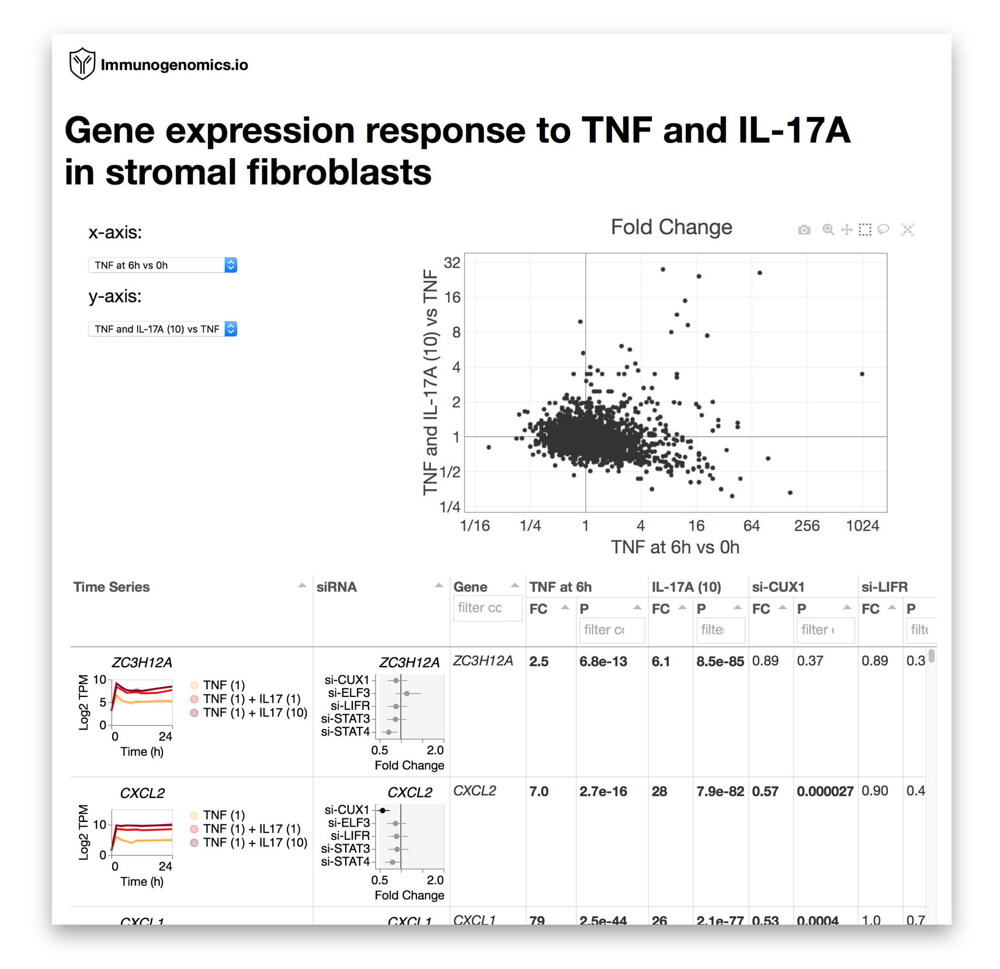

# fibrotime 

Explore the gene expression response to tumor necrosis factor (TNF) and interleukin 17 (IL-17A).
Our data includes experiments with time series, dose response, and gene silencing.

## :rocket: Explore the data

  <b>https://immunogenomics.io/fibrotime</b>
  

## :mortar_board: Read the paper

**CUX1 and IκBζ mediate the synergistic inflammatory response to TNF and IL-17A in stromal fibroblasts**

Kamil Slowikowski, Hung N. Nguyen, Erika H. Noss, Daimon P. Simmons, Fumitaka Mizoguchi, Gerald F.M. Watts, Michael F. Gurish, Michael B. Brenner, Soumya Raychaudhuri

*bioRxiv* 2019. https://doi.org/10.1101/571315

## :octocat: Get the code

This repository includes the code for all of the analyses,
and it also includes a stand-alone HTML and Javascript data viewer.

Look for the Jupyter notebook files in the [analysis] folder to
see how I ran the analyses.

All the files needed to run the data viewer are in the [website]
folder.

[analysis]: https://github.com/slowkow/fibrotime/tree/master/analysis
[website]: https://github.com/slowkow/fibrotime/tree/master/website

## :floppy_disk: Get the data

All of the RNA-seq and microarray gene expression data is available at NCBI GEO:

<ul>
<li><a href="https://www.ncbi.nlm.nih.gov/geo/query/acc.cgi?acc=GSE129488">GSE129488</a></li>
</ul>

Experimental data (QPCR, ChIP-PCR, ELISA, Migration) is availabe in the [experiments.xlsx] file.

[experiments.xlsx]: https://github.com/slowkow/fibrotime/blob/master/analysis/data/experiments.xlsx?raw=true
